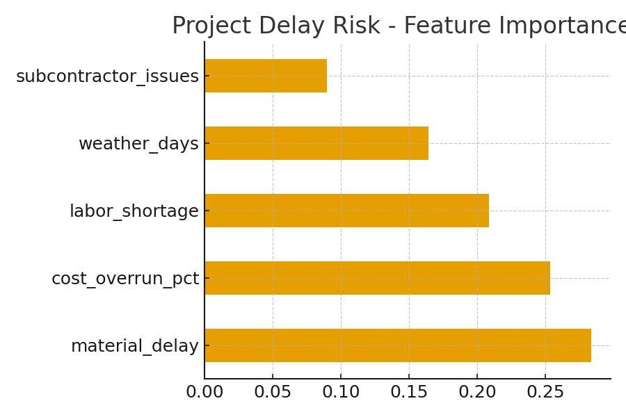

# Project Delay & Risk Analysis

Predicts infrastructure project delays using Random Forest classification.

## Files
- project_delays.csv → dataset
- delay_risk_model.py → Python script
- delay_feature_importances.png → plot showing risk factors

## Insights
- Top risk drivers: material delays, labor shortages, weather

### Results

